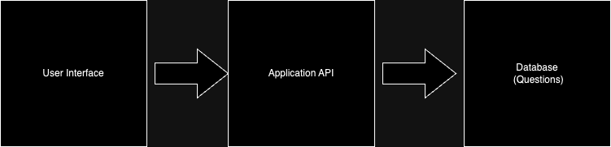

# Trivia Trek

Trivia Trek is a web-based  application designed to offer a dynamic and engaging experience for users looking to test their knowledge, learn new information, or simply enjoy a fun and interactive activity. It caters to a wide range of use cases, from educational institutions conducting assessments to entertainment platforms offering trivia games.

## Trivia Trek Application Architecture Diagram:

Trivia Trek Data Flow

